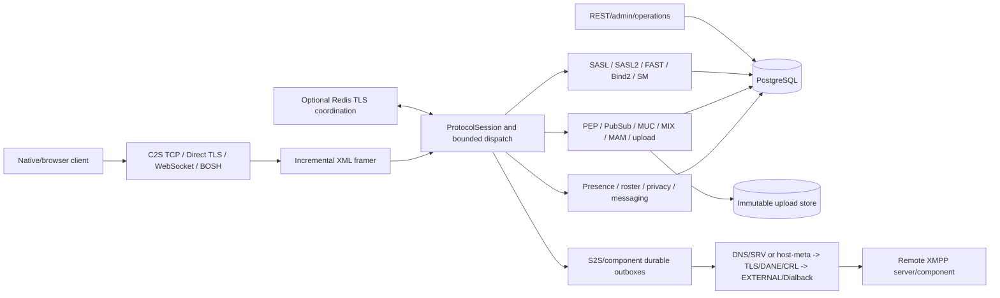

# Architecture and security model

## Deployment baseline

The supported baseline is one Northstar Tokio process on Linux, one PostgreSQL
database, and an immutable upload store. Local disk is the single-node default;
the S3-compatible backend is the shared cluster implementation. The process serves mandatory
STARTTLS C2S on `5222`, Direct TLS C2S on `5223`, STARTTLS S2S on `5269`, Direct
TLS S2S on `5270`, WebSocket and optional BOSH, REST/static UI/health on
`8080`, private metrics on loopback `9091`, and optional external components on
disabled-by-default `5347`.

PostgreSQL is authoritative for accounts, credentials, rosters, privacy and
block lists, archives, offline delivery, MUC/MIX, PEP/PubSub, vCards, upload
metadata, push, moderation, API idempotency/operations, anti-abuse admission,
S2S/component outboxes and bounded XEP-0198 state. Upload bytes are written
atomically through `UploadStore`; PostgreSQL fences local or shared S3 object
lifecycle and bounded reconciliation. Live
sockets and connection queues remain process-local.

Optional Redis coordinates same-domain full-JID and MUC routing between
Northstar processes. It is an experimental, non-durable transport, not a second
system of record or an application-authentication boundary. Remote Redis
requires `rediss://` hostname verification and may use a private CA and mTLS.
Every command/ACK additionally uses an exact Ed25519 signed-envelope format v8
inside the independently versioned node/delivery contract v11, plus a
PostgreSQL-authorized key-bound process-instance lease. Explicit fail-closed or
PostgreSQL-spool-only degradation keeps bind/resume/MUC/admin/transient work out
of an unreconciled cluster. Redis does not replicate upload objects; public
cluster mode therefore requires the shared S3-compatible backend. Redis cannot turn
Pub/Sub into durable delivery.

## Protocol and data flow

The XML framer tokenizes incrementally, tracks nesting depth, validates UTF-8
and namespaces, and applies byte/depth/time limits. Nested forwarded, MAM and
Carbon stanzas therefore do not terminate at the first inner closing element.
All transports reuse `ProtocolSession`; transport framing does not create a
second authentication or authorization implementation.

## Authentication and channel binding

Legacy SASL supports TLS-protected PLAIN, SCRAM-SHA-256 and
SCRAM-SHA-256-PLUS, with optional SCRAM-SHA-1 compatibility and EXTERNAL where
a configured client trust root authorizes a certificate identity. SASL2 adds
inline Bind2/SM and XEP-0484 FAST. FAST implements HT-SHA-256-NONE plus the
available ENDPOINT/EXPORTER channel-bound mechanisms, mechanism/installation
pinning, one current plus one pending token, replay counters, rotation and an
absolute strong-reauthentication deadline. TLS 0-RTT is not accepted.

Passwords use Argon2id while SCRAM verifiers are independently derived and
therefore remain an offline-guessing target if the database is stolen.
`SCRAM_ITERATIONS` applies to newly created/upgraded verifiers and must be
benchmarked on the deployment host.

## Federation trust path

Outbound S2S performs bounded SRV discovery, RFC 2782 ordering and deterministic
IPv6/IPv4 Happy Eyeballs. Direct TLS and STARTTLS share PKIX/XMPP identity
validation. SASL EXTERNAL is preferred; XEP-0220 Dialback is permitted only
inside TLS and only after a fresh authoritative callback.

`FEDERATION_DANE_MODE` is `off`, `opportunistic` or `required`. The resolver
validates DNSSEC locally and binds the secure SRV relationship, chosen A/AAAA
socket and TLSA record. The implemented RFC 7712 profile accepts usage 1
PKIX-EE and usage 3 DANE-EE. Usage 1 retains PKIX/path/time/EKU/XMPP identity;
usage 3 can replace PKIX/name/time only after secure TLSA validation, while the
leaf must still be structurally strong and prove private-key possession in the
TLS handshake. Required mode rejects overrides, XEP-0487 and insecure fallback.

Optional local PEM CRLs validate every non-root certificate in the applicable
federation, XEP-0487 HTTPS or C2S client chain and fail closed on unknown,
expired or invalid status. Northstar does not fetch attacker-selected CRL/AIA
URLs and does not implement OCSP. Atomic TLS reload changes future handshakes
and rechecks the complete chain recorded for authenticated C2S and S2S SASL
EXTERNAL sessions. Only an exact applicable `CertRevoked` result drains that
connection; expiry, renewal, trust-policy changes and inconclusive validation
do not blanket-kick streams. Surviving established sessions retain their
originally negotiated TLS material.

These are implementation facts with automated local evidence. Public
authoritative DNS/DNSSEC/TLSA, the served certificate chain, public IPv6,
firewalls and independent peers remain operator validation.

## Message durability and exactly-once boundary

Bare-JID routing selects the highest non-negative resource priority; Carbons,
blocking/privacy, CSI, push, hints, archive and offline policy are applied by
the common messaging path. Message PoW admission persists opaque HMAC actor
keys, one-use challenges, payload MACs, fencing leases and bounded
pending/accepted tombstones. Exact replay is suppressed and changed payloads
conflict while the tombstone exists. Offline storage has independent durable
dedupe and a 30-day post-delivery admission tombstone.

Ordinary local or federated `normal`/`chat` delivery commits the authoritative
message identity, enabled MAM writes and a transient recipient spool row in one
transaction before queueing. The spool identity crosses local and Redis
routing with the stanza. With XEP-0198, the persisted unacknowledged sequence
entry owns the exact spool fence through socket output, disconnect and resume;
only client `h` completes it. Without SM, TCP/WebSocket use successful socket
write as their server-visible completion boundary. BOSH binds the fence to the
response RID before exposing bytes and deletes it only after an authenticated
client response `ack`; cached duplicate RIDs are byte-identical. Session loss
or lease expiry releases, rather than completes, an unacknowledged row.
Members-only direct and mediated MUC invitations carry the same durable fence
through local or cluster routing; accepting one into a bounded queue is never
treated as delivery completion. Automatic retention/TTL cleanup excludes every
SM/BOSH owner, while generic administrative clearing fails with a conflict if
transport-owned rows are present.

An explicit XEP-0334 `no-store` direct message takes a separate volatile path
instead of entering this durable contract. It creates no MAM, recipient spool,
offline row, personal-history admission projection or S2S outbox. Local and
cross-node online routes are attempted directly; a remote recipient additionally
requires an already authenticated writable S2S or XEP-0288 bidi stream. An
unavailable, saturated or timed-out live route returns `wait/service-unavailable`
rather than silently persisting the stanza. Personal-history retractions and
members-only direct MUC invitations reject `no-store` because their state
transitions are necessarily durable. Headlines and Carbons remain best-effort.
PubSub/PEP mutation events have their own PostgreSQL recipient-snapshot outbox.

This does **not** make online XMPP exactly-once. A crash after transport output
but before the applicable SM/BOSH client acknowledgement (or non-SM spool
completion) can duplicate the same stable XEP-0359 identity, and XMPP has no
general application-processing acknowledgement. S2S and external
components have the same ambiguity, but every durable message outbox row is
stamped once from its UUID so all retries preserve an idempotency key.

PubSub/PEP mutations atomically commit their immutable audience, stable event
ID and exact bytes/digest to PostgreSQL. A leased worker retries local, cluster,
digest and S2S projections. The final transport boundary remains at-least-once
and no distributed exactly-once transaction is claimed.

## End-to-end confidentiality

The browser implements OMEMO 2 device/bundle publication, X3DH, Double Ratchet,
explicit trust/TOFU, multi-device repair/retirement, direct/group encryption,
Stanza Content Encryption and encrypted file sources. Private identity/session
material remains in browser storage; the server stores only public PEP material
and encrypted envelopes. Encrypted upload bytes are AES-GCM ciphertext and the
key/IV/name/type metadata travels inside OMEMO/SCE.

`REQUIRE_ENCRYPTED_ARCHIVE=true` prevents plaintext message bodies from being
persisted in personal/MUC archives and offline storage. It is a storage policy,
not a promise that the server cannot see plaintext voluntarily sent on a live
connection. Routing metadata, membership, timing, approximate sizes and
user-submitted decrypted report evidence remain server-visible. The server
cannot recover lost browser OMEMO private keys.

## Recovery and capacity evidence

XEP-0198 queues and authorization state are PostgreSQL-backed. A clean
disconnect resumes immediately; crash recovery waits for the bounded owner
lease. Reauthorized local MUC occupancy can be reconstructed, but remote room
ownership is never fabricated during resume.

The simple load fixture authenticates 1,000 WebSocket resources and pings them.
The production-envelope fixture additionally uses a release build, samples
Direct TLS/WebSocket authentication latency, sends fan-out traffic, resumes 100
SM sessions, tests overload rejection/recovery and records RSS, file descriptor
and database-pool bounds. This is automated local design evidence, not an SLA or
a production-capacity guarantee. Repeat it with target-host limits, PostgreSQL
I/O, proxy and monitoring enabled.

Database dumps and uploaded bytes form one recovery set. Local backup/restore tooling
uses staged publication, manifests/checksums, database-to-file size/SHA-256
verification, a dedicated marked rollback root and dual-plane compensation.
Checksums detect corruption but do not authenticate a backup. S3 deployments
instead require an exact PostgreSQL locator manifest plus a provider-native
versioned-object backup and isolated reference validation; a local tar never
contains S3 bytes. Operators must
store encrypted/authenticated copies off-host. Browser private keys are outside
server backups.

See [XEP_MATRIX.md](XEP_MATRIX.md),
[docs/PRODUCTION_OPERATIONS.md](docs/PRODUCTION_OPERATIONS.md),
[docs/UPLOAD_STORAGE.md](docs/UPLOAD_STORAGE.md) and
[docs/KNOWN_ISSUES.md](docs/KNOWN_ISSUES.md) for the precise support and
deployment boundaries.
