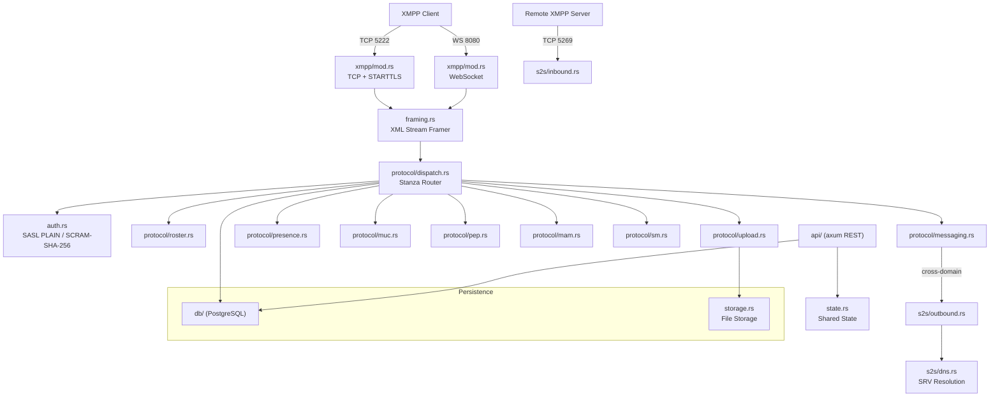

# Architecture, Compliance & Security

## 1. Module Architecture



## 2. Connection Lifecycle

**TCP connection:**
```
Client → TCP connect → <stream:stream>
  → Server: <features> + <starttls required/>
  → Client: <starttls/>  →  Server: <proceed/>
  → TLS handshake completes
  → Server: <features> + <mechanisms> (SCRAM-SHA-256, PLAIN)
  → SASL authentication (multi-round handshake)
  → Server: <success/>  →  stream reset
  → Server: <features> + <bind/> + <sm/>
  → Client: <iq><bind><resource/></bind></iq>
  → Session ready — stanzas may be exchanged
```

**WebSocket connection:** Skips STARTTLS (WS is already encrypted or secured by reverse proxy). Uses `<open xmlns='urn:ietf:params:xml:ns:xmpp-framing'/>` instead of `<stream:stream>`.

---

## 3. Standards Compliance

### Core Protocols

| Standard | Clause | Status | Notes |
|----------|--------|--------|-------|
| RFC 6120 | XML Framing | ✅ | Custom state-machine framer; max depth 256, frame ≤ 1 MiB |
| RFC 6120 §7.7.1 | Resource Binding | ✅ | Auto-generates UUID when client omits `<resource>` |
| RFC 6120 §5 | STARTTLS | ✅ | Mandatory for TCP; WebSocket exempt |
| RFC 6121 | Roster | ✅ | Bidirectional subscription handshake |
| RFC 6121 | Offline Messages | ✅ | Auto-stored, delivered on initial presence |
| RFC 7395 | WebSocket | ✅ | `<open>` framing, reuses TCP framer logic |

### Authentication

| Standard | Status | Notes |
|----------|--------|-------|
| SASL PLAIN (RFC 4616) | ✅ | TLS-only; strict authz/authc identity separation |
| SCRAM-SHA-256 (RFC 7677) | ✅ | Full GS2 header + zero-knowledge proof; PBKDF2 default 600,000 iterations |

### XEP Extensions

| XEP | Status | Key Implementation Details |
|-----|--------|---------------------------|
| 0030 (Disco) | ✅ | Dynamically injects user's published PEP nodes into feature list |
| 0045 (MUC) | ✅ | Non-anonymous by default; broadcasts real JIDs in presence |
| 0059 (RSM) | ✅ | MAM paging with `<first>` / `<last>` / `<count>` |
| 0060/0163 (PEP) | ✅ | Multi-item publish; auto-UUID for missing IDs; `<item-not-found>` for empty nodes |
| 0077 (IBR) | ✅ | With invitation token system |
| 0191 (Blocking) | ✅ | Enforced at message routing layer |
| 0198 (SM) | ✅ | Sliding window ack + resume with configurable timeout |
| 0280 (Carbons) | ✅ | Multi-device message synchronization |
| 0313 (MAM) | ✅ | Time-range filtering + RSM paging; optional encrypted-only archive policy |
| 0357 (Push) | ✅ | Basic push notification relay |
| 0363 (Upload) | ✅ | Two-phase slot request + UUID-keyed storage; path traversal immune |

---

## 4. Security Design

### 4.1 Authentication & Authorization
- **Password storage:** Argon2 with random salt; SCRAM credentials (PBKDF2-HMAC-SHA256) stored independently
- **Timing attack mitigation:** Dummy Argon2 hash computed for non-existent users (`verify_against_dummy_hash`), preventing username enumeration
- **API authorization:** All admin endpoints gated by `api::admin()` which verifies the `is_admin` flag

### 4.2 Injection Prevention
- **SQL injection:** All queries use `sqlx` parameterized bindings (`.bind()`); zero `format!`-based SQL
- **Path traversal:** Uploads keyed by UUID; user-supplied filenames never touch the filesystem
- **XML injection:** All user input passed through `attr_escape` before interpolation into XML responses

### 4.3 Denial of Service Mitigation
- **XML depth limit:** Max nesting 256 levels; immediate disconnect on violation
- **Frame size limit:** Frames exceeding 1 MiB trigger immediate disconnect
- **CPU exhaustion guard:** Password hashing concurrency capped by `Semaphore(8)`
- **Rate limiting:** Per-IP/user sliding window + proof-of-work (PoW) challenge escalation

### 4.4 HTTP Security Headers
All HTTP responses include:
- `Content-Security-Policy` (with `frame-ancestors 'none'`)
- `X-Content-Type-Options: nosniff`
- `Referrer-Policy: no-referrer`

### 4.5 Dynamic Test Results
The following attack vectors were confirmed blocked against a live server:
- `GET /uploads/..%2f..%2fetc%2fpasswd` → 400 Bad Request
- `GET /api/v1/admin/stats` (no token) → 401 Unauthorized
- TCP: 300-level nested XML → connection immediately dropped
- TCP: 1.5 MiB single frame → connection reset by server

### 4.6 Memory Safety
- Zero `unsafe` code blocks across the entire codebase
- `AppError::Internal` returns a generic `"internal server error"` message; details logged server-side only
