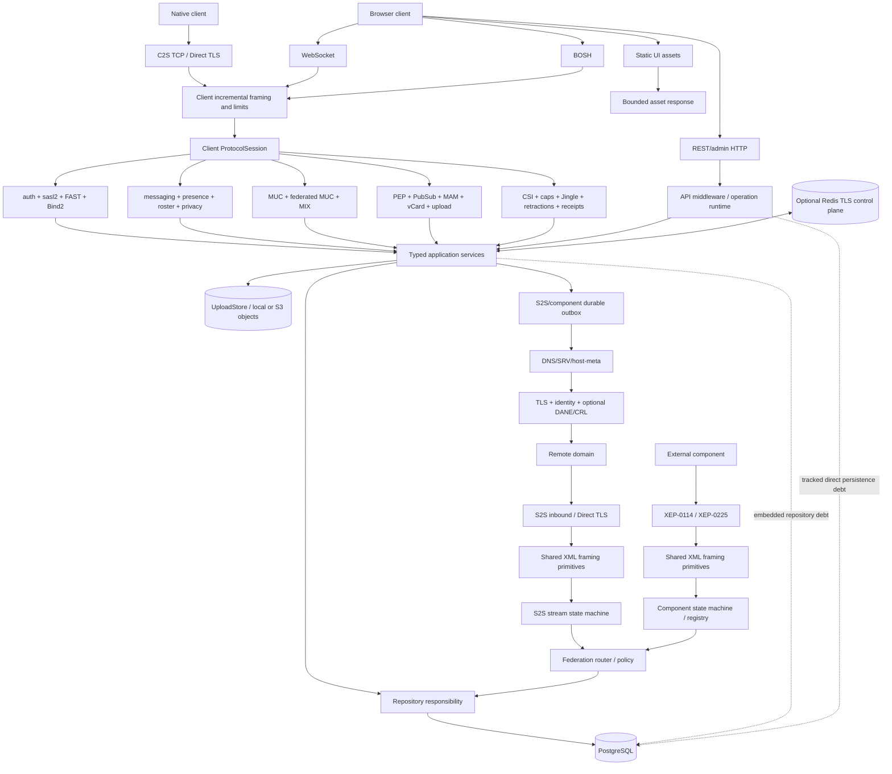

# Northstar internal architecture

This document maps the current implementation to its security and persistence
boundaries. Protocol support claims belong in [../XEP_MATRIX.md](XEP_MATRIX.md);
operational procedures belong in [PRODUCTION_OPERATIONS.md](PRODUCTION_OPERATIONS.md).

The binary supports combined operation or independent core and maintenance
processes over shared PostgreSQL. [Subserver ownership](SUBSERVERS.md) specifies
their exact capabilities, health boundaries and deployment lifecycle. Core
retains all live-session authority; maintenance receives only retention policy,
a bounded database pool and metrics.

Durable MIX delivery uses retained PostgreSQL commit and reconnect notifications
to request a fresh authorized claim. Consecutive empty claims schedule recovery
scans after 250 ms, 500 ms, then at most one second. A notification or completed
delivery restores immediate claiming; newly claimed work restores the fast
cadence. A missed notification, lease expiry or timed retry can therefore add
up to 750 ms of discovery delay compared with the previous fixed 250 ms scan.
PAM results have no dedicated commit notification and retain their fixed 250 ms
scan. Database-turn deadlines, lease fences and worker health requirements are
unchanged; an idle timer alone never marks a worker healthy.

## Module map

Key ownership:

- `src/xmpp/framing.rs` incrementally frames XML with byte/depth/time limits.
- `src/xmpp/protocol/` owns negotiated wire behavior and error mapping. The
  protocol tree no longer imports database authority/domain symbols, accesses
  a pool, or uses SQLx directly; persistence is reached only through the
  purpose-specific application-service capabilities exposed by `AppState`.
- `src/services/messaging.rs` owns personal-message communication policy and
  durable admission. The stanza handler still owns XML and live routing, but
  cannot directly query users/blocking/privacy or compose MAM, S2S outbox, C2S
  spool and offline writes. `src/db/messaging.rs` implements the injected
  repository and retains each complete admission transaction, including
  members-only invitations. Typed decisions keep blocked, privacy-denied,
  missing, stored, replay and quota outcomes explicit at the boundary.
- `northstar-message-core` and `northstar-message-application` own the
  capability-free personal-message command/result contract and injected
  commit repository. Local C2S, authenticated S2S, component ingress and
  federation egress therefore share one authority check and transaction
  entry point.
- `northstar-room-core` and `northstar-room-application` own the first room
  command boundary: local/federated discussion identity, exact occupancy
  authority, repository injection and bounded ordered post-commit plans.
  PostgreSQL remains the final room-policy authority under its existing locks;
  the remaining room mutations are tracked convergence work.
- `src/services/replay.rs` owns XEP-0160 account leases, bounded page claims
  and the single-snapshot blocking/privacy decision. Protocol replay code owns
  only ordered transport backpressure. A slow socket never retains a primary
  PostgreSQL connection, and an exact unsent suffix can be released without
  clearing rows already transferred to SM, BOSH or socket-write fencing.
- `src/services/roster.rs` owns authenticated RFC 6121 mutations and one
  repeatable-read XEP-0237/PAM snapshot. Each live resource enters a bounded
  version gate before the snapshot; only after the IQ result owns the
  transport are later committed pushes flushed in order. Overflow or queue
  failure disconnects the resource and forces a full resync. Local and
  cluster removal delivery is fenced by the exact account UUID so a deleted
  localpart cannot redirect an old transition to a recreated account.
- Roster and upload reservation services use their existing application ports.
  Passkeys HTTP delegates WebAuthn ceremonies to its service; accepting a
  credential revision, issuing FAST and creating the API session commit together.
  MAM uses an archive port and only a wake channel for post-commit delivery.
- MUC uses an injected room repository for complete mutations and snapshots.
  Room and occupant fences stay inside the PostgreSQL adapter. A separate wake
  port sends committed operation notifications; notification failure records
  degraded health and leaves the durable outbox available for polling.
- Profile publication uses one repository operation for vCard, avatar/PEP
  changes and their notification audience. The application service keeps the
  shared PubSub mutation permit until that operation finishes or is cancelled.
- PubSub and PEP use the repository traits in `northstar-pubsub-application`.
  Validation and admission stay in the service; PostgreSQL operations own
  policy locks, item/subscription changes and the immutable outbox audience.
  XML rendering uses domain snapshots while those locks are held. Notification
  claims carry their payload digest and lease token without a hidden database
  row or a second copy of the payload.
- Blocking, privacy, Push and private XML storage use injected repository
  ports. Privacy keeps live-resource conflict checks in the service, and
  private storage keeps quota policy and bookmark extension preservation.
  Adapters retain the existing account locks and complete batch mutations.
- Presence uses complete subscription operations through an injected port.
  Account generations, privacy, roster changes and federation outbox admission
  remain in one repository transaction; the service keeps outbound policy order.
  Administrative notice claims carry domain values rather than database rows.
- Offline replay separates resource validation and policy from durable lease,
  page and transport-fence operations. Cursor and lease values belong to the
  service boundary; the adapter retains PostgreSQL clock and ownership checks.
- MIX keeps bounded FIFO admission, content commitments and committed delivery
  wakes in the service. Its repository handles channel transactions and durable
  projections; a stateless application serializer builds the exact persisted
  replies and recipient payloads from shared domain values.
- Stream management retains device policy, memory accounting and local wake
  subscriptions in its service. The repository commits binding, FAST, privacy
  and transport ownership together. A database adapter runs the shared authority
  listener on its existing reserved connection.
  Suspension recovery receives only its persistence port, shared MUC suspension
  maps, cluster projection capability and queue limits. Recreated contexts share
  the same endpoint identities and capacity leases. Session cleanup accesses
  SM revocation, privacy cleanup, temporary rooms and presence through services.
- REST history, users, reports, invitations, upload dead letters and server
  statistics use a query repository that revalidates the bearer, credential
  generation and administrator role in the same transaction as the projection.
  Local session and room snapshots execute under those locks; pagination keeps
  the PostgreSQL clock and existing cursor scope. These handlers extract a
  query context containing the service, cursor signer and read-only runtime
  projections. It shares live policy flags and session maps without retaining
  global application state. Operation-journal reads use the same context and
  preserve separate bearer/role errors and parent-scoped targets.
- Operation cancellation/reconciliation, report moderation, invitations and
  upload retry commands use dedicated services. Their HTTP contexts hold only
  the relevant command service. Repository adapters share administrative
  admission: acquire the connection, check live cluster health, lock the exact
  administrator bearer/generation, and commit business changes with replay.
  Invitation replay also checks that its secret-bearing resource remains valid.
- TLS reload, panic disconnect, island-mode changes, room destruction and
  broadcast requests now enter a separate administrative dispatch service.
  Its repository commits the operation, audit, replay response and any room
  intent or runtime setting together before a worker performs the effect.
- User and room retention policies have a separate context containing the
  service, policy ceilings and read timers. Reads hold bearer/account locks
  through the policy snapshot; writes preserve policy, audit and replay in one
  transaction. Legal-hold/export endpoints still need persistence boundaries.
- Deployment capacity renewal and expiry cleanup use a typed maintenance
  service and PostgreSQL repository. Renewal snapshots exact route IDs and
  cancellation tokens from the shared session map; the reaper has no session
  map authority. Worker deadlines, election locks and cancellation behavior
  remain unchanged.
- Public configuration and host metadata use a discovery context containing
  startup policy and the live registration and island-mode flags. HTTP transport
  middleware receives only trusted proxy addresses and its rejection counter;
  the administrator listener receives a separate gateway credential verifier.
  These entry paths no longer need general application state for those checks.
- Report and appeal services validate content before requesting a complete
  repository operation. Authorization, proof admission, semantic rejection or
  business mutation, and encrypted response replay share one transaction.
  First responses and retries use the same status, headers and body bytes;
  submission counters advance only after a new commit. Their HTTP context
  provides identity lookup, submissions and those counters without global state.
- OMEMO recovery uses lifecycle repository operations. Transfer and authority
  reads hold the exact bearer and account-generation locks through the snapshot.
  Public completion polling has its own context, bounded IP/concurrency
  admission and dedicated pool; it accepts only the transfer capability and
  cannot invoke account mutations. The authenticated consume handler still
  needs global state for post-commit session teardown.
- Administrator commands validate claim identity and page bounds before the
  repository. Sensitive reads retain their generation lock and snapshot;
  command mutations retain their dedicated database authority.
- Authentication keeps mechanism policy and dummy SCRAM derivation in the
  service. Its repository owns verifier reads, FAST derivation and atomic
  generation, epoch and binding checks; authenticated identities contain no
  reusable credential material.
- Retractions validate owner projections and compute content commitments before
  persistence. Tombstones, action archives and delivery share one repository
  transaction, including replay and account fences.
- Account registration reserves password-work capacity before entering its
  repository. The adapter holds the shared abuse authority and commits proof,
  invitation, credential and account changes together. Deletion recovery uses
  a typed claim with the original token and retry count.
- Embedded and standalone retention workers share the same narrow context.
  Retention and subscription cleanup receive repository operations, policy and
  metrics, with no raw pool or global application state.
- Upload reconciliation receives a repository, its four maintenance limits,
  the exact storage generation and namespace, the guarded object store and
  shared metrics. Startup audit evidence remains one-use across worker restarts.
- `src/db/` is the primary repository/routine layer for transactional
  persistence, replay, canonical identity and migration-time invariants.
  Several application services and API/cluster/federation/worker paths still
  embed SQL/transaction work; these are tracked extraction debt rather than a
  claim that the physical repository split is already universal.
- `src/s2s/` owns discovery, DANE, TLS, EXTERNAL/Dialback and durable delivery.
- `src/components.rs` isolates component domain authority and outbox handling.
- `src/bosh.rs` and the WebSocket path adapt HTTP framing to the same
  `ProtocolSession` state machine.
- `northstar-delivery-core::OrderedOutboundSink` separates session ordering
  from the Tokio queue adapter. A rejected or stale item is returned to its
  durable owner, and only the adapter owns channel/cancellation primitives.
- `src/abuse.rs` owns PostgreSQL-backed PoW/rate/message-admission policy.
- `src/cluster.rs` owns optional Redis leases/PubSub, the node/delivery-contract
  protocol v13 and its explicit degraded state machine;
  `src/cluster_security.rs` independently owns the signed Ed25519 envelope
  format v8, node ACLs and replay binding; `src/db/cluster_keys.rs` owns
  non-secret key generations and key-bound process-instance leases. Redis
  locates live sockets and carries authenticated cross-node commands but is
  never authoritative.
  PostgreSQL retains the security fences, storage-eligible direct-message
  spools and durable queues listed below.
- `src/api/` and `src/operation_runtime.rs` own REST authorization,
  idempotency, bounded operations and ambiguous-effect handling.
- `web/omemo.js` owns browser endpoint cryptography; the server never receives
  its private device/session keys.

The architecture gate measures protocol/database dependency and public state
capability in monotonic budgets. The current baseline is `AppState=9` public
fields and, across the production protocol tree (excluding `#[cfg(test)]` code),
`0 db authority references / 0 db domain-model references / 0 state.pool / 0
sqlx:: / 0 PgPool`. Importing or aliasing database symbols is rejected so an
import cannot hide authority. These zero protocol/database ceilings must remain
zero; the nine public `AppState` capabilities may only decrease as narrower
domain ports replace them. API, service, worker and repository transaction
boundaries require separate runtime checks; subsystem-specific database roles
remain incomplete. `messaging.rs` additionally has semantic
gates forbidding raw pool access and bypasses of `MessageService`.

`AppState` no longer exposes raw FAST or Dialback key bytes, REST cursor and
idempotency keyrings, upload storage, client/upload admission internals, the
message persistence capability, or the worker registry as public fields.
It supplies purpose-specific FAST and Dialback operations and narrow internal
capability accessors. Secret byte vectors are zeroized when state is dropped.
Background policy, cleanup, digest, Redis and recovery work is registered with
the worker supervisor: security-critical exits or heartbeat expiry cancel the
service, restartable exits or heartbeat expiry abort the stuck attempt and use
bounded backoff, and repeated business-health failures degrade `/readyz`.

## Responsibility and capability layers

The complete component-by-component matrix, including accepted inputs,
forbidden capabilities, transaction/failure owners, supervisors, enforcement
levels and residual shared authority, is maintained in
[Program responsibility and authority model](PROGRAM_RESPONSIBILITIES.md).

Northstar uses module boundaries to narrow ordinary control flow, but not every
row below is an operating-system or database security boundary. The enforcement
column records what currently makes the separation real; the final column keeps
shared-authority exceptions visible.

| Layer | Current responsibility | Enforcement | Residual shared authority / exception |
| --- | --- | --- | --- |
| Transport adapters | TCP/TLS, WebSocket/BOSH framing, byte/depth/time limits, connection lifetime | module APIs and parser/transport tests | same process as protocol and runtime services |
| Protocol sessions | negotiation state, stanza parsing, RFC/XEP error mapping, per-resource ordering | production-tree static gate forbids DB symbols, SQLx and raw pools | inline test code is excluded from that gate; session still calls `AppState` service capabilities |
| Application services | authorization snapshots, message/roster/replay policy, transaction intent and typed outcomes | Rust visibility, typed ports and targeted semantic gates | several services still embed SQLx/`PgPool`; some operation/background paths also hold broad `Arc<AppState>` |
| Database repository responsibility | SQL, lock order, transactions, durable identity, outbox/admission invariants | PostgreSQL workload ACLs, reviewed routines and Rust module boundary | primarily `src/db/*`, but some service/API/cluster/federation/worker paths still embed persistence; most share the runtime role |
| Live routing | exact connection incarnation, loss-explicit ordered admission, bounded backpressure, SM/BOSH/socket transfer fences | injected ordered-output port, bounded adapter queues, disconnect/fallback rules and delivery-fence state | in-memory availability state is process-local by design |
| Federation/components | remote identity, discovery/TLS/Dialback and durable outbox ownership | authenticated streams, domain checks and durable repositories | S2S/component code remains in the same binary and runtime role |
| Cluster control plane | signed node envelopes, leases, socket hints and degraded state | envelope verification plus PostgreSQL authority; Redis is non-authoritative | multi-node mode remains experimental and shares the server process |
| Background workers | registered lifecycle, heartbeat and restart/fail-fast policy | worker registry and readiness/fatal cancellation | several workers still receive broader `AppState` access than the target port design |
| REST/admin operation runtime | API authentication, idempotency, command authorization and recovery | API middleware, operation journal and isolated command-role pool | REST and XMPP run in one process; operation runtime still has broader state access in places |
| Browser cryptography | endpoint OMEMO key/session operations | browser code and no server private-key API | same-origin frontend delivery remains in the E2EE trust/supply-chain boundary |

The production database identities are intentionally non-interchangeable:

| Identity | Persistent capability | Explicit exclusions |
| --- | --- | --- |
| `northstar_bootstrap` | Fresh-volume and guarded existing-volume role/ACL convergence | never mounted into application, migration, backup or restore jobs |
| `northstar_migrator` | owns the application database/schema, runs migrations, exact grant reconciliation and stopped restore; has one explicit database-level `CONNECT` on `postgres` | no superuser, role/database creation, replication, bypass-RLS or maintenance-database `TEMPORARY`; restore control pins `pg_catalog,pg_temp` |
| `northstar_runtime` | executes the runtime capability manifest and accesses only its allowlisted application objects | no DDL ownership, maintenance database access, command-only routines or backup-wide reads |
| `northstar_commands` | executes the exact administrative command routine manifest | no application relation privileges, migration authority or general runtime capability |
| `northstar_backup` | read-only backup/ledger-attestation surface | no writes, DDL, restore, maintenance database or application-server capability |

Disaster recovery divides one migrator credential into four program roles: a
maintenance controller in `postgres`, a target coordinator that owns
database-local maintenance/barrier locks, a primary replacement executor and a
compensation executor. Fence mutation/audit is a controller function;
transaction outcome arbitration belongs to the target coordinator after its
database-local barrier. These are independently registered and reaped child
sessions with separate command paths, but they are not separate PostgreSQL ACL
identities, credentials or restart domains; compromise of the
restore parent or migrator credential can bypass the division. The controller
never receives replacement SQL, the coordinator never receives dump replay,
and the parent fsyncs the executor's `xid8` before destructive SQL while the
coordinator accepts only `pg_xact_status()` after the matching transaction
barrier rather than using READY/DONE, EOF or process exit as commit evidence.
Static gates reject the former custom database-GUC marker and ambiguous generic
database-session functions; the isolated PostgreSQL suite is required to
provide behavioral evidence for lock scope and cutover ordering.

## Connection state machines

Native C2S requires STARTTLS before legacy SASL. Direct TLS starts inside the
same protected state. WebSocket requires the `xmpp` subprotocol and RFC 7395
framing; production security depends on trusted HTTPS proxy provenance. BOSH
uses an opaque CSPRNG SID stored as a keyed lookup digest, ordered bounded RID
processing and byte-identical limited replay.

After protection, the server advertises only mechanisms available for that
transport and certificate/channel-binding state:

- PLAIN only inside TLS;
- SCRAM-SHA-256 and `-PLUS`, with optional SHA-1 compatibility;
- EXTERNAL only when a configured client-certificate trust path can authorize
  the identity;
- SASL2 with inline Bind2/SM;
- FAST HT-SHA-256-NONE and the available ENDPOINT/EXPORTER mechanisms.

Legacy SASL restarts the XML stream. SASL2 does not. Successful inline SM
resume is evaluated before a fresh Bind2, and failed resume is reported before
new binding. Resource publication and token/login state are transaction-gated.

## Entity-capability observation authority

XEP-0115 state is owned by the accepted full-JID presence observation, not by
the disco cache or an asynchronous work queue. Each local observation carries
the exact C2S `(connection_id, generation)`; each federated observation carries
the authenticated S2S/component `connection_id` plus a unique observation ID
that distinguishes repeated advertisements on one stream. A per-resource gate
orders federated available/unavailable presence, disco correlation and the
resulting PEP/MIX effects. Local cleanup and every federated connection teardown
compare-remove only their own incarnation, so a late response, unavailable or
worker completion cannot recreate or modify a replacement observation.

Hash verification produces a compact semantic projection containing only the
two MIX feature decisions consumed by server behavior and the complete
top-level `+notify` node list. That list is not page-truncated: the existing
64-KiB disco payload and 512-child parser limits are its explicit wire/resource
boundary. The current observation owns its projection independently of the
optional raw-document and same-key summary cache. Cache expiry, byte pressure
or LRU eviction may cause a new query or a disco-proxy miss, but cannot change a
verified PEP/OMEMO/MIX interest decision into a negative answer.

Asynchronous side effects remain authoritative for the lifetime of the
in-process observation as pending/running effect bits. The bounded dispatcher contains
only deduplicated wake hints, with independent local and federated FIFO classes
served alternately. Saturation or a worker cancellation does not remove an
effect bit; saturation sets an event-driven rescan flag, and worker cleanup
restores in-flight bits before requesting the same reconstruction. A failed
effect records an exact exponential `retry_at`, and the worker sleeps until the
earliest retry or pending-IQ expiration rather than polling. There is no retry
count, cache TTL or queue-capacity condition that declares accepted semantic
work complete. A full exact local transport disconnects instead of reporting a
successful disco/PEP send.

The remaining limits are explicit memory and peer-isolation policy. Local
observation count is bounded by C2S admission. Federated observations have
global and per-domain hard counts and are admitted before presence routing;
over-budget remote presence receives `resource-constraint`. Raw cache,
reusable-summary cache, current-observation summaries and effect execution each
have separate byte/count/concurrency budgets. Summary pressure retains the
observation and its pending verification rather than silently discarding node
interest. These bounds protect process availability; they do not substitute
for ownership, ordering or effect completeness.

## Persistent state and migrations

PostgreSQL stores every state that must survive a normal restart: identities,
credentials, API sessions, roster/privacy/blocking, MAM/offline, MUC/MIX,
PEP/PubSub, SM replay, push, moderation, PoW/admission, operation journals and
federation/component outboxes. Identity migrations run under advisory and
table locks, canonicalize through the maintained RFC 7622/PRECIS/IDNA path,
detect collisions before writing, and commit completion markers atomically.

The release migration gate anchors the published 0001-0013 SHA-256 files,
creates a random isolated 0013 schema, records SQLx SHA-384 checksums, inserts
representative old data, runs the real domain migrator through the complete
current repository migration set, compares every checksum/data fingerprint,
proves checksum-tamper rejection and idempotence, then verifies exact schema
cleanup. It is local automated evidence,
not an authorization to run tests against an operator database.

## Delivery semantics

### Online C2S

Storage-eligible `normal`/`chat` delivery to a locally hosted account first
commits a transient recipient spool row together with the trusted XEP-0359
identity and any enabled MAM rows. That database fence follows the stanza
through the bounded local or cross-node channel. The cluster node/delivery
contract protocol v13 carries the exact recipient/row fence explicitly; the
receiver verifies both the PostgreSQL row and its payload before any socket
queue accepts it. Unsafe
volatile/durable combinations with a legacy v6 peer fail closed. When
XEP-0198 is enabled, TCP, WebSocket and BOSH persist the exact spool fence in
the counted unacknowledged entry before transport output and delete it only
when client `h` advances (including resume). Without SM, TCP/WebSocket retain
the older successful-socket-write completion boundary. BOSH instead binds the
fence to the exact response RID before exposing the response; only a later
authenticated response `ack` completes it, and duplicate RID replay reuses the
same cached bytes. Session loss or lease expiry removes the owner but leaves
the spool row eligible for ordered replay.

Competing XEP-0198 resume requests do not poll PostgreSQL. Migration `0127`
adds a monotonic `state_version` to each durable SM row; every insert, update
or delete emits a commit-ordered `northstar_sm_authority_v1` notification that
contains only the installation schema, session UUID and version. Each process
owns one supervised `PgListener` connection outside the request pool and fans
these hints into session-scoped watch slots. A resume request subscribes and
then immediately repeats the authoritative claim statement, closing the
query/subscribe lost-wakeup window. It subsequently waits for exactly one of a
matching one-shot notification edge, listener-generation change, exact local
route removal, new-connection cancellation or the database-returned
lease/expiry boundary. The notification's `state_version` is only an exact-edge
optimization: every delivered edge advances a process-local sequence and is
consumed by an authoritative recheck, so a stale or forged high version earns
at most one extra query and cannot suppress a later real transition.
The process-local maximum-snapshot reservation exists only during an actual
claim query and is released for the entire Pending wait. A valid bearer may
cancel only the exact local connection incarnation named by PostgreSQL;
cross-node ownership is never inferred from an in-memory event and changes
only after a committed authority transition or its persisted boundary.

Migrations `0133` and `0134` extend that same supervised PostgreSQL listener
with a schema-only MIX durable-delivery wake. The notification is only a
commit-ordered hint: a MIX worker always reclaims the fenced recipient row
before delivery. A verified MIX-capable resource advances the persisted
route-wake generation of the current ordered recipient head. The generation is
captured with its lease, so a concurrent defer or retry cannot overwrite an
already committed route transition with a recovery delay. A dead-letter retry
is reinserted at the current recipient tail rather than reusing historical
sequence order. Migrations `0135`–`0137` extend this rule to every resumable
and cross-node boundary. SM entries and BOSH response fences store a typed MIX
source rather than a generic message ID. A v13 cross-node command carries the
exact leased recipient source; the destination atomically rotates it into a
node/request fence before queueing it, and may report success only after that
fence becomes a direct socket fence, XEP-0198 entry, or BOSH response owner. A
bounded process queue admission or a Redis acknowledgement is never an
acknowledgement.

Members-only direct and mediated MUC invitations use this same ownership
contract. Their affiliation and spool row commit atomically; local and Redis
routes carry the exact `DurableDelivery`, and queue acceptance never completes
the row. Retention, foreground TTL/capacity cleanup and generic admin clearing
cannot remove an SM/BOSH-owned row. Explicit account deletion remains the
documented destructive parent boundary.

XEP-0077 account removal consumes its operation-bound v2 proof in the same
transaction that disables the account, advances its authentication generation,
revokes API/FAST credentials, and creates an `account_deletion_requests`
recovery row. Durable XEP-0198 teardown is deliberately completed before the
user row is deleted, because the user foreign key owns the retry evidence. If
the process exits after quiesce but before deletion, a supervised worker waits
five minutes, claims at most sixteen requests with a fifteen-minute lease, and
replays the same teardown/deletion coordinator. Failed jobs release their
lease with bounded retry state; successful user deletion cascades the request.
Thus a crash can extend the fail-closed disabled interval but cannot silently
leave a permanently quiesced account with no recovery owner.

An explicit XEP-0334 `no-store` direct message takes a separate volatile path:
no MAM, recipient spool, offline row or personal-history admission projection
is created. Local and cross-node online routes are attempted directly. A
remote recipient additionally requires an already authenticated writable S2S
or bidi stream; the server waits for the bounded socket write and never falls
back to the durable S2S outbox. Every unavailable, saturated or timed-out route
returns `wait/service-unavailable`. Personal-history retractions and
members-only direct MUC invitations reject explicit `no-store` because their
history/affiliation changes are durable state transitions. Transient
signal-only messages, headlines, Carbons and post-commit notification fan-out
also remain best-effort.

No exactly-once claim is made: failure after successful transport output but
before the applicable SM/BOSH client acknowledgement (or non-SM row
completion) can duplicate the same stable stanza ID.

### Offline, archive and admission

Offline rows and archive rows commit before durable acceptance. Message
admission stores HMAC-scoped identities, payload MACs, fencing leases and
bounded tombstones. Exact replay is suppressed while a changed payload
conflicts. Offline delivery has independent replay claims/dedupe and a 30-day
post-delivery admission tombstone. Migration `0103` replaces process-scoped
advisory ownership with one crash-recoverable logical lease per account. Its
90-second owner interval strictly outlives the 60-second page claim plus
jitter, so the first owner that can take over an expired account lease can
also reclaim every abandoned, non-transport-owned row. Personal MAM
sender/recipient rows, the C2S
spool and the S2S outbox are independent recovery projections: removing one
only nulls its reference and refreshes completion time. The payload-bearing
projection becomes eligible for its own retention independently. Migration
`0104` removes plaintext from the durable admission identity and stores only a
purpose-separated HMAC plus key-generation ID; the bounded identity becomes
eligible for fixed 30-day cleanup only after all four projection references
are null. Per-owner MAM retention therefore cannot erase a live replay fence,
retain it without a finite bound, or create a second plaintext history store.

All application-owned SQL and PL/pgSQL functions are catalog-enumerated by
migration `0099` and pinned to `pg_catalog`, the quoted installation schema,
then `pg_temp`. System and extension-owned objects are excluded; a mismatched
application-function owner aborts migration. The pre-migration audit found no
function that intentionally depends on a caller-selected schema or temporary
relation, so there are no path exemptions. The migration verifies that owner,
`SECURITY DEFINER` state, ACLs and every non-path function setting remain
unchanged, and the isolated-schema upgrade fixture checks the resulting catalog
and invokes archive/offline triggers under a caller path that omits the
application schema.

The production runtime role has SELECT-only access to `users`. Migration
`0108` installs typed, migrator-owned, schema-pinned `SECURITY DEFINER`
commands for every production account-authority mutation. Registration,
credential upgrade/rotation, REST administrator changes, XEP-0133 lifecycle
commands, deletion, roster-version increments and OMEMO recovery-generation
consumption therefore use explicit compare-and-swap or actor/session fences
without restoring a generic patch, dynamic-SQL, writable-view or custom-GUC
escape hatch. Direct runtime and column-level account DML are denied and
attested at startup; PIE import deliberately requires the one-shot migrator
credential.

XEP-0133 issuance is split again: the isolated `northstar_commands` pool has no
relation or sequence access and can execute only eight session lifecycle
functions. It accepts a high-entropy client bearer and creates a separate,
short-lived execution claim; PostgreSQL stores only keyed hashes bound to the
exact administrator UUID, username, `auth_generation`, command node and
canonical submission digest. The normal runtime pool can only consume that
claim in a command-specific mutation which locks the session, actor and target,
then commits mutation, revocation projections, audit and terminal result in one
transaction. Runtime SQL alone cannot mint or inspect this authority.

Credential rotation, disablement and deletion cancel local routes and durable
SM state after the commit. The same database transaction records a revocation
for each registered node process. PostgreSQL notifications and signed Redis
events wake the consumers; a one-second poll recovers missed notifications.
Each process acknowledges the exact revision only after fencing its local
routes. Database failures close local sessions, while the existing 30-second
authorization sweep remains a backstop. Multi-node mode is Experimental;
revocation is asynchronous and does not promise a zero-length partition window.

### Federation and components

Outboxes are bounded, ordered, expiring and restart-safe. A durable message is
stamped once with a server-authoritative XEP-0359 `stanza-id` derived from the
outbox UUID, and every retry reuses those exact stored bytes. A failed write
keeps the row. S2S peers that negotiate XEP-0198 must acknowledge the stanza
before its fenced outbox claim is completed. The acknowledgement window is
bounded to 256 stanzas and 15 seconds. Peers can request up to 60 seconds of
process-local resumption after a transport failure. A fresh TLS connection and
the same authenticated domain pair, authentication method and BIDI mode are
required. One actor owns the counters, replay buffer and federated room state;
resumption transfers the transport and closes the previous connection.

Replay is limited to 4 MiB per stream and 64 MiB per process, with at most 128
resumable inbound streams. Outbox leases are checked before acknowledgement
and replay. Volatile/no-store stanzas retain only their sequence position; a
resume can succeed only if the peer has already handled them. Clean XML close,
expiry, lost leases, process restart or reconnection to another node falls back
to the durable outbox retry policy. There is no cross-process S2S resume cache.

Peers without SM and XEP-0114/XEP-0225 components complete at socket write.
An acknowledgement or database completion can still be lost, so delivery
remains at-least-once. Stable XEP-0359 IDs and durable inbound admission suppress
exact message retries; this does not guarantee arbitrary peers will deduplicate.

### PubSub and PEP

Mutation state, immutable recipient/options snapshots, stable event IDs and
exact payload bytes/digests commit together in `pubsub_event_outbox`. Fenced
workers claim bounded, target-domain-fair batches and acknowledge only after
local, cluster, digest or federated routing accepts the stable event. Lease
takeover makes process/node restart recoverable; a write-before-ack crash can
still duplicate the same ID, so this is at-least-once rather than exactly-once.
Digest projection is idempotent by source delivery ID. Same-domain subscribers
on another process use the Redis cluster route, but Redis is only a live-route
optimization and never the event authority. Remote-domain subscribers use
authenticated S2S. See `docs/PUBSUB_EVENT_OUTBOX.md` for snapshot ordering,
capacity, TTL, dead-letter and non-coalescing rules.

### MIX delivery and PAM capacity authority

Every application-service method capable of creating a durable MIX delivery
enters one clone-shared FIFO gate before checking out a PostgreSQL connection.
The repository first commits migration-`0128`'s complete orphan-event cleanup
and release-journal fold, then opens the producer transaction. Its first SQL
statement takes a schema-local blocking advisory fence before any channel,
participant, event, recipient or sequence lock. The process gate preserves the
request pool under same-process contention; the database fence is the
cross-process serialization and fixed lock-order authority. Neither is a
rate-limit or a substitute for the capacity ledger.

An exact `(delivery_id, lease_token)` ACK deletes only its leased recipient.
Owner-held delete triggers append immutable row/template release facts without
taking the producer fence or mutating a shared capacity bucket. Admission drains
those facts and reserves exact row/byte deltas atomically. Reconciliation commits
before the later producer decision, so rejecting a genuinely full admission
cannot roll back the cleanup needed to make future space visible. A release
that commits after reconciliation is a later linearized transition and is seen
by a following admission; correctness does not rely on a fixed retry count,
bounded GC page or worker interval. Stable delivery IDs retain the ordinary
at-least-once recovery boundary if database completion is uncertain.

MIX-PAM has separate owner-maintained exact global and per-account counters.
Join, leave and retention-prune entry points share another pre-pool FIFO gate;
database triggers use the fixed account-row, global-counter, user-counter order.
Runtime cannot insert/delete the operation journal or update counters directly.
The owner-held insertion capability revalidates the enabled account, pending
membership and matching durable S2S outbox in the same transaction. A complete,
independently committed reconciliation removes every retention-eligible
terminal operation before producer admission, while unresolved late-result
authority remains charged by design. The `100,000` delivery rows/`256 MiB`
delivery bytes and `10,000` global/`64` per-account PAM records are explicit
hard resource policy; an actual ceiling returns an error instead of weakening
transactional ownership.

## Federation security

Discovery applies bounded SRV/A/AAAA/host-meta parsing, special-use address
policy, RFC 2782 ordering and Happy Eyeballs. Direct TLS and STARTTLS use the
same XMPP identity verifier. EXTERNAL is preferred; Dialback requires TLS,
fresh callback correlation and bounded verification.

The optional DANE resolver proves DNSSEC locally and binds secure SRV,
selected address and TLSA. Usage 1 retains normal PKIX/XMPP validation. Usage 3
can replace PKIX/name/time only after a secure TLSA match, while structural
leaf/key checks and TLS CertificateVerify possession still apply. Required
mode rejects configured overrides and XEP-0487 fallback.

Optional CRL files cover the configured C2S/federation trust paths, validate
the non-root chain and fail closed. No OCSP or online CRL/AIA fetcher exists.
TLS reload atomically swaps a monotonic material generation for new handshakes.
An encapsulated registry retains the complete peer chain and exact cancellation
token only after C2S or S2S SASL EXTERNAL succeeds. Reload rechecks those chains
and drains only an exact applicable `CertRevoked`; expiry, renewal, trust-policy
changes and other validation failures do not blanket-kick streams. Dialback and
password-authenticated sessions are outside that certificate-authenticated
registry. XEP-0487 pins cannot bypass configured CRLs, while DANE-EE retains its
RFC 7673 semantics of replacing PKIX.

Public DNSSEC/TLSA, real CA chains, IPv6 reachability and independent peers are
operator evidence, not inferred from unit fixtures.

## Privacy model

Browser OMEMO performs X3DH and Double Ratchet endpoint operations, wraps
content for trusted recipient and own devices, supports group/device repair and
stores private material in IndexedDB. SCE hides message/file metadata inside
the encrypted envelope. Upload storage sees ciphertext only when the browser
encrypts before PUT.

The server still observes JIDs, routing, membership, timestamps, device IDs,
approximate sizes and any deliberately submitted plaintext/report evidence.

Data lifecycle policy and legal-hold transaction boundaries are centralized in
`db::data_lifecycle` and `db::retention`; protocol handlers do not decide what
held data may be removed. Operator ceilings, monotonic user/room overrides,
typed exact/scope hold links, offline ACK snapshots, immutable releases and
audit-chain exports are described in [DATA_LIFECYCLE.md](DATA_LIFECYCLE.md).
`REQUIRE_ENCRYPTED_ARCHIVE` constrains persistence, not what a live plaintext
sender exposes. A server backup cannot restore browser-held OMEMO private keys.
The optional browser-to-browser move keeps its Argon2id/AES-GCM package local;
PostgreSQL stores only its digest, monotonic generation and one-consumer
high-water fence. The source freezes immediately and import resets contact
trust. It is not key escrow or a reusable backup; see
[OMEMO_DEVICE_TRANSFER.md](OMEMO_DEVICE_TRANSFER.md).

## Denial-of-service and control-plane bounds

- first-level XML, nesting, negotiation bytes/time and authenticated idle time;
- global/per-IP C2S, per-account resources and shared S2S/component limits;
- BOSH RID/request/response/session queues and replay amplification;
- bounded password-hash concurrency;
- PostgreSQL-backed actor windows, challenge capacity, free bursts, quadratic
  PoW, hard waits, maximum work and stepped cooldown;
- per-owner PEP/PubSub node/item/byte and archive/offline/upload quotas;
- API idempotency/operation capacity, leases and fail-stop ambiguous effects;
- S2S/component outbox rows/bytes/expiry and strict per-domain ordering.

Production and cluster startup require a mounted anti-abuse HMAC key; a random
process key is available only to an explicit single-node loopback development
profile. Migration `0082` makes PostgreSQL authoritative for the domain's
non-secret current/previous key IDs, monotonic epoch and overlap/retirement
phase. Startup, readiness and the supervised authority monitor fail closed when
a node's mounted keys or epoch do not match that authority. Rotation retains the
previous key until the minimum overlap and all durable challenge/admission
references have expired; PostgreSQL stores only purpose-separated key IDs, not
the HMAC key material.

The PubSub digest worker retains its one-second polling interval and five-second
health watchdog. An empty tick uses one read-only eligibility query under the
existing shared database permit instead of opening a mutation transaction. The
query checks the same due/lease predicate, verifies UPDATE privilege and rejects
read-only transaction mode even when no row is due. Its two-second caller deadline
includes pool acquisition; it does not assert immediate cancellation of
server-side SQL. A negative result
is never cached, so new work is discovered on the next normal tick. A positive
result still uses the original bounded transaction, SKIP LOCKED and claim lease;
concurrent claimers and authorization errors retain their existing semantics.

The durable API operation executor also avoids opening a claim transaction when
the journal has no pending or running operation. Its repository preflight checks
the original empty path's schema and column privileges and rejects read-only
transaction mode. A negative result is not cached: the existing 250 ms idle
interval discovers later work. Every pending or running operation, including a
future retry, active lease, cancellation, expired or revoked operation, still
enters the original expiry, authorization and claim logic. The executor keeps
claim and target initialization in one transaction, with the original lease and
effect fences. Neither idle preflight is a guarantee that write locks will be
available when actual work arrives.

## Evidence classification

Automated local suites exercise the implemented profiles using isolated
schemas, ports, certificates and processes. The 1,000-session production
envelope uses authenticated resources without initial presence and records
connection, full-JID message, SM-resume and resource bounds on one development
host; it is neither a 1,000-active-user workload nor an SLA. The August 25
Gajim observation proves one localhost encrypted MUC send
with three test accounts and a development certificate; the client version was
not recorded and later source changes were not thereby revalidated.

Operators must separately validate the real certificate served through the
proxy/listeners, public A/AAAA/SRV/DNSSEC/TLSA, firewall/NAT/IPv6, external S2S,
CRL refresh, monitoring receivers, target-host capacity, off-host authenticated
backup and at least two independent clients.
