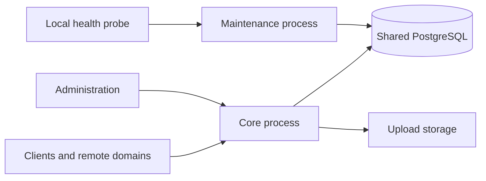

# Independent subservers with a shared database

Northstar can run two independent processes from the same binary and source
revision. This is the first supported implementation step toward smaller
servers for a single maintainer. PostgreSQL remains the common schema and
transaction authority. The `services/*` distributed prototypes are separate
from this deployment and remain prototypes.

## Process ownership

| Process | Command | Owns | Inputs |
| --- | --- | --- | --- |
| Core | `xmpp-server serve core` | Client and federation transports, live sessions, message admission and delivery, public HTTP, administration, durable operation processing, session recovery, upload storage | Existing core configuration and secrets |
| Maintenance | `xmpp-server serve maintenance` | Archive/offline retention, completed retraction retention, expired audit and governance artifacts, physical PubSub subscription cleanup | Runtime database credential, domain, numeric retention policy |
| Combined compatibility mode | `xmpp-server serve standalone` or no arguments | Both responsibility groups in one process | Existing core configuration and secrets |



`xmpp-server --subservers` prints the machine-readable process inventory.
Core is still the only owner of in-memory sessions and transport delivery.
Administrative revocation, connection counts and routing therefore retain a
single authority. Workers that need these capabilities remain inside core.
Maintenance does not construct `AppState`, initialize protocol services, load
TLS/signing keys, mount uploads, or read the core `.env` file.

`src/subservers.rs` owns command selection, maintenance configuration, process
lifecycle and private health. `src/retention.rs` receives only a retention
policy, database pool and metrics. Retention SQL belongs to `src/db/retention.rs`.
`src/subscription_cleanup.rs` owns physical subscription cleanup with only the
existing pool, narrow counters and independent readiness; its SQL remains in
`src/db/pubsub.rs`. Application services and protocol handlers remain outside
these maintenance dependency paths.

Core tracks whether a connection has ever attempted to reserve or receive a
live-session lease or binding claim. It records that possibility before the
first database write can occur and keeps it after errors or local state resets.
A connection that never attempted either operation needs no database lease
release. Such an empty cleanup does not clear earlier cleanup health failures.
SM suspension and replacement keep their existing exact-owner cleanup rules.

When core shuts down, MIX stops taking new work and gives already-started claims
and deliveries the existing 14-second drain window. A normally completed lane
does not cancel its draining peer. Database turns and delivery attempts retain
their deadlines. An uncertain completion or forced stop retains the untransferred
claim's 90-second lease. Ownership already transferred to a direct socket, SM,
BOSH or another node follows that transport's existing token fences and recovery
lifetime. Direct sockets use a separate 30-second write fence.

An authenticated bidirectional federation connection can wake one matching
queued S2S head whose previous connection failure is still in backoff. Core
owns this single-use connection hint; PostgreSQL retains queue order, attempt
and lease authority. A pending send keeps its lease until its normal failure
transition completes. Disconnected or replaced streams cannot reuse the hint,
and delivery still checks the current federation policy.

## Run from source

Complete the normal [database role and migration setup](DATABASE_ROLES.md)
first. Use matching binaries and the same domain, schema and retention policy.
Only the migrator job performs migrations; neither server migrates at startup.

For a source-built Compose deployment:

```sh
docker compose -f docker-compose.yml -f deploy/docker-compose.subservers.yml config --quiet
docker compose -f docker-compose.yml -f deploy/docker-compose.subservers.yml up --build -d
docker compose -f docker-compose.yml -f deploy/docker-compose.subservers.yml ps
docker compose -f docker-compose.yml -f deploy/docker-compose.subservers.yml logs maintenance
```

Use these same two Compose files for later lifecycle commands. The overlay
changes the existing `xmpp` service to core, adds maintenance and waits for
maintenance readiness before starting core. It retains the base migration and
grant jobs. It builds both processes from the local source; do not combine it
with a release image override from an older revision without matching the
maintenance image too.

For a host service manager, start these as separate supervised units:

```sh
# Core uses the normal protected core environment and files.
xmpp-server serve core

# In a separate unit, explicitly provide only this process's configuration.
XMPP_DOMAIN=example.com DATABASE_URL_FILE=/run/secrets/runtime_database_url \
  xmpp-server serve maintenance
```

Do not source the core `.env` into the maintenance unit. Production uses the
attested `northstar_runtime` role, without migrator or administrator-command
credentials. Each process may restart independently. Maintenance needs no
upload directory, writable root filesystem or public port.

## Configuration and capacity

| Maintenance setting | Default | Meaning |
| --- | --- | --- |
| `XMPP_DOMAIN` | Required | Same prepared domain as core |
| `DATABASE_URL_FILE` | Required, or explicit `DATABASE_URL` | Protected runtime URL file; the two inputs are mutually exclusive |
| `MAINTENANCE_BIND` | `127.0.0.1:9092` | Nonzero loopback socket only |
| `MAM_RETENTION_DAYS` | `365` | Inherited personal archive retention; `0` disables the global default |
| `MUC_MAM_RETENTION_DAYS` | `365` | Inherited room archive retention; `0` disables the global default |
| `OFFLINE_MESSAGE_TTL_DAYS` | `30` | Inherited offline retention; `0` disables the global default |
| `AUDIT_LOG_RETENTION_DAYS` | `730` | Audit retention, minimum 30 days |
| `RETENTION_CLEANUP_BATCH_SIZE` | `1000` | Per-table work bound, range 1–10000 |
| `RETENTION_CLEANUP_INTERVAL_SECONDS` | `60` | Cleanup interval, range 60–86400 |

Explicit per-user or per-room retention still applies when a global default
is `0`. Legal holds and existing lifecycle policy resolution remain in force.

Maintenance has a fixed three-connection pool, including its ownership
connection, and bounded query/lock waits. Core limits its primary pool to 57
connections, leaving room for its four existing auxiliary connections and
maintenance within the shared runtime role's limit of 64. The default primary
pool remains 32. These budgets assume one core and one maintenance process.
This topology does not authorize running several independent core replicas
against the same domain: their live session state is not distributed.

Core reserves its runtime-control connection within one 15-second admission
window, including role attestation. Later, the command and OMEMO recovery pools
share a separate 15-second startup window, including command-role attestation.
Only connection-pool timeouts may retry; authentication and attestation failures
abort startup. These auxiliary pools keep their two-second acquisition limit
while serving. The windows bound those initialization phases, not all startup
work; the listener fixture independently retains its total 15-second readiness
deadline.

Core owns upload authority and capacity auditing. Startup completes both audits
before accepting traffic. Its first upload worker may use those successful
observations once, scheduling the next catalog audit from the original audit
start plus 60 seconds and the next ledger audit from its start plus one hour.
The five-second namespace and policy probe still runs immediately. An expired
observation triggers its audit immediately; a failed initial probe, invalidated
safety gate, or worker restart requires fresh audits. This replaces duplicate
startup audits without granting their results a new lifetime at worker startup.
A failed catalog or ledger read immediately closes upload writes and readiness.
Until the existing retry (15 seconds for the catalog, 60 seconds for the ledger),
waiting ticks only pulse liveness: they neither recount that cached error nor
clear preceding failures. Three actual consecutive read failures still stop the
critical worker. Confirmed catalog violations and ledger mismatches retain their
per-tick terminal behavior, including while the other audit is waiting. Each
tick reports at most one of these audit errors. A clean result from one audit
alone cannot restore writes or clear health. Writes resume at the complete
authority-check boundary; worker health clears only after the remaining
reconciliation work also succeeds.

The loopback-only maintenance endpoint provides `/healthz`, `/readyz` and
`/metrics`. Readiness requires independently completed successful archive and
subscription cleanup passes, healthy supervised workers and the database
ownership connection. It is false during either pending pass, after either
cleanup fails, and until that worker completes a successful pass. One worker's
success cannot clear the other's failure. Requests have fixed concurrency, size and time bounds.
In Compose, probe it inside the maintenance container; it has no host port.
Metrics describe this process and are not a cluster-wide total. The existing
core Prometheus target does not automatically include maintenance metrics.

## Listener and readiness CI coverage

The Federation and MIX federation fixtures first prepare every pair, then start
pairs in batches sized from the runner's effective CPU capacity. At most
`min(pairs, max(1, effective_cpus / 2 rounded down), 4)` pairs start at once;
a four-CPU runner therefore starts two pairs per batch. Within each pair, A
must pass readiness before B starts. The next batch waits until every server
in the current batch has passed its nonce-bound listener and HTTP readiness
checks. Startup permissions are bound to the run, round and pair.

Each process retains its 15-second readiness deadline from its actual startup.
Queueing is included in the existing 900-second worker deadline. Earlier
batches remain running while later batches start. The coordinator checks the
recorded process identities and liveness, including earlier batches, before
advancing and before releasing all pairs into the concurrent business tests.
A dead server fails the round; neither startup nor a failed round is retried.

Regular CI still runs 20 rounds of 50 pairs, with all 100 servers live before
concurrent protocol work begins. The scheduled matrix runs 100 rounds of the
same 50-pair workload. Smoke tests retain the one-pair and two-pair cases.
This validates concurrent operation and bounded startup on the available
runner; it does not claim that all 50 pairs can cold-start simultaneously.
MIX records each pair's listener ownership while that pair still holds its
startup slot, using one TCP-table snapshot and one file-descriptor snapshot
per owner. A single coordinator checks the signed setup records and original
process identities while waiting; pending pairs do not spawn repeated status
commands. These bounds reduce fixture overhead without reducing protocol work.
Both fixture families retain application INFO/WARN/ERROR and inbound S2S
debug logs, without tracing every idle background polling turn. Failure
diagnostics retain bounded readiness reasons, warnings and errors.
Fixed host pressure counters are sampled at the live barrier and before failed
cleanup; no concurrent resource sampler runs during the workload.
The startup scheduler's failure paths are also checked independently of a
database using controlled child processes.

## Switch and recover

1. Record the current configuration and backup according to the operations
   guide. Keep all retention settings identical during the topology change.
2. Stop the existing combined process and wait for graceful shutdown.
3. Start maintenance, wait for `/readyz`, then start core. Check both process
   health and normal client login/message delivery.
4. To roll back, stop both processes before starting the combined command.
   This change does not add or rewrite a database migration.

The compatibility guarantee covers the existing single-node combined command.
An experimental cluster with several old no-argument servers must change its
startup commands: retain one combined archive owner and use `serve core` for
the other nodes, or use core nodes with one separate maintenance process. A
second combined process now fails startup instead of becoming another retention
owner. Keep the experimental cluster's separate identity, Redis and aggregate
database-capacity requirements; this change does not promote it to production.

All active retention owners participate in a database advisory ownership
lock. A conflicting process fails startup. Loss of the ownership connection
stops the worker after a bounded health probe; this is process supervision,
not a transaction fencing token. In-flight SQL on other connections can
briefly finish after ownership loss. Retention continues to use bounded,
idempotent database deletion and row locking. Do not use this mechanism as
permission to overlap deployments with different retention policies.

Maintenance failure pauses automatic cleanup until it recovers; core retains
its own health signal and continues serving existing traffic. Alert on both
services. Restore operations must stop **both** processes, follow the existing
database/host fences, and restart maintenance and core only after recovery
authority is verified.

## Subscription cleanup ownership

Physical PubSub subscription cleanup runs in maintenance, or under the same
maintenance ownership claim in standalone mode. Core does not register this
worker. Expiration remains an authorization predicate in the repository, so
waiting for physical deletion does not extend an expired subscription's access.
Existing immutable event snapshots retain their delivery authority.

The worker starts immediately and then runs every 60 seconds. Each pass keeps
the existing 1,000-row batch limit and SQL timeouts, with a 40-second deadline
covering acquisition, both deletion statements and commit. Its independent
110-second silence watchdog covers the interval, pass and scheduling margin.
Cancellation or an incomplete pass leaves its readiness false. Cleanup uses the
existing maintenance pool; it neither acquires the shared delivery turn nor
runs inside the five-second digest delivery worker. Pool and database-role
connection limits remain unchanged.

## Security boundary and remaining work

Separate processes now provide separate lifecycle, configuration and secret
inputs. They still share a database role with the existing runtime table
privileges. A compromised maintenance process therefore has broader database
access than its normal cleanup operations require. This stage does not claim
database privilege isolation or distributed transaction independence. A later
dedicated maintenance role needs its own attestation, immutable grants
migration, restore fencing and negative authorization tests.

Keep the shared database and the two process roles until an explicit service
contract can preserve session and revocation semantics. Further extraction
must move actual ownership and verify failure behavior, rather than only
starting another service shell.
