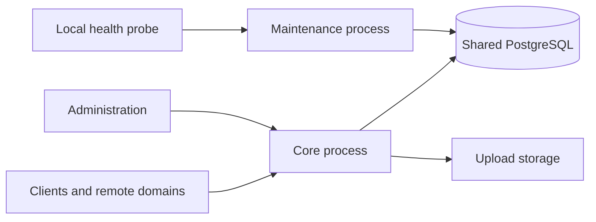

# Independent subservers with a shared database

Northstar can run two independent processes from the same binary and source
revision. This is the first supported implementation step toward smaller
servers for a single maintainer. PostgreSQL remains the common schema and
transaction authority. The `services/*` distributed prototypes are separate
from this deployment and remain prototypes.

## Process ownership

| Process | Command | Owns | Inputs |
| --- | --- | --- | --- |
| Core | `xmpp-server serve core` | Client and federation transports, live sessions, message admission and delivery, public HTTP, administration, durable operation processing, session recovery, upload storage | Existing core configuration and secrets |
| Maintenance | `xmpp-server serve maintenance` | Archive/offline retention, completed retraction retention, expired audit and governance artifacts | Runtime database credential, domain, numeric retention policy |
| Combined compatibility mode | `xmpp-server serve standalone` or no arguments | Both responsibility groups in one process | Existing core configuration and secrets |



`xmpp-server --subservers` prints the machine-readable process inventory.
Core is still the only owner of in-memory sessions and transport delivery.
Administrative revocation, connection counts and routing therefore retain a
single authority. Workers that need these capabilities remain inside core.
Maintenance does not construct `AppState`, initialize protocol services, load
TLS/signing keys, mount uploads, or read the core `.env` file.

`src/subservers.rs` owns command selection, maintenance configuration, process
lifecycle and private health. `src/retention.rs` receives only a retention
policy, database pool and metrics. Retention SQL belongs to `src/db/retention.rs`.
Application services and protocol handlers remain outside that dependency path.

## Run from source

Complete the normal [database role and migration setup](DATABASE_ROLES.md)
first. Use matching binaries and the same domain, schema and retention policy.
Only the migrator job performs migrations; neither server migrates at startup.

For a source-built Compose deployment:

```sh
docker compose -f docker-compose.yml -f deploy/docker-compose.subservers.yml config --quiet
docker compose -f docker-compose.yml -f deploy/docker-compose.subservers.yml up --build -d
docker compose -f docker-compose.yml -f deploy/docker-compose.subservers.yml ps
docker compose -f docker-compose.yml -f deploy/docker-compose.subservers.yml logs maintenance
```

Use these same two Compose files for later lifecycle commands. The overlay
changes the existing `xmpp` service to core, adds maintenance and waits for
maintenance readiness before starting core. It retains the base migration and
grant jobs. It builds both processes from the local source; do not combine it
with a release image override from an older revision without matching the
maintenance image too.

For a host service manager, start these as separate supervised units:

```sh
# Core uses the normal protected core environment and files.
xmpp-server serve core

# In a separate unit, explicitly provide only this process's configuration.
XMPP_DOMAIN=example.com DATABASE_URL_FILE=/run/secrets/runtime_database_url \
  xmpp-server serve maintenance
```

Do not source the core `.env` into the maintenance unit. Production uses the
attested `northstar_runtime` role, without migrator or administrator-command
credentials. Each process may restart independently. Maintenance needs no
upload directory, writable root filesystem or public port.

## Configuration and capacity

| Maintenance setting | Default | Meaning |
| --- | --- | --- |
| `XMPP_DOMAIN` | Required | Same prepared domain as core |
| `DATABASE_URL_FILE` | Required, or explicit `DATABASE_URL` | Protected runtime URL file; the two inputs are mutually exclusive |
| `MAINTENANCE_BIND` | `127.0.0.1:9092` | Nonzero loopback socket only |
| `MAM_RETENTION_DAYS` | `365` | Inherited personal archive retention; `0` disables the global default |
| `MUC_MAM_RETENTION_DAYS` | `365` | Inherited room archive retention; `0` disables the global default |
| `OFFLINE_MESSAGE_TTL_DAYS` | `30` | Inherited offline retention; `0` disables the global default |
| `AUDIT_LOG_RETENTION_DAYS` | `730` | Audit retention, minimum 30 days |
| `RETENTION_CLEANUP_BATCH_SIZE` | `1000` | Per-table work bound, range 1–10000 |
| `RETENTION_CLEANUP_INTERVAL_SECONDS` | `60` | Cleanup interval, range 60–86400 |

Explicit per-user or per-room retention still applies when a global default
is `0`. Legal holds and existing lifecycle policy resolution remain in force.

Maintenance has a fixed three-connection pool, including its ownership
connection, and bounded query/lock waits. Core limits its primary pool to 57
connections, leaving room for its four existing auxiliary connections and
maintenance within the shared runtime role's limit of 64. The default primary
pool remains 32. These budgets assume one core and one maintenance process.
This topology does not authorize running several independent core replicas
against the same domain: their live session state is not distributed.

Core reserves its runtime-control connection within one 15-second admission
window, including role attestation. Later, the command and OMEMO recovery pools
share a separate 15-second startup window, including command-role attestation.
Only connection-pool timeouts may retry; authentication and attestation failures
abort startup. These auxiliary pools keep their two-second acquisition limit
while serving. The windows bound those initialization phases, not all startup
work; the listener fixture independently retains its total 15-second readiness
deadline.

The loopback-only maintenance endpoint provides `/healthz`, `/readyz` and
`/metrics`. Readiness requires a completed successful cleanup pass, healthy
supervised workers and the database ownership connection. It is false during
a pending pass, after any cleanup failure, and until a successful pass restores
health. Requests have fixed concurrency, size and time bounds.
In Compose, probe it inside the maintenance container; it has no host port.
Metrics describe this process and are not a cluster-wide total. The existing
core Prometheus target does not automatically include maintenance metrics.

## Switch and recover

1. Record the current configuration and backup according to the operations
   guide. Keep all retention settings identical during the topology change.
2. Stop the existing combined process and wait for graceful shutdown.
3. Start maintenance, wait for `/readyz`, then start core. Check both process
   health and normal client login/message delivery.
4. To roll back, stop both processes before starting the combined command.
   This change does not add or rewrite a database migration.

The compatibility guarantee covers the existing single-node combined command.
An experimental cluster with several old no-argument servers must change its
startup commands: retain one combined archive owner and use `serve core` for
the other nodes, or use core nodes with one separate maintenance process. A
second combined process now fails startup instead of becoming another retention
owner. Keep the experimental cluster's separate identity, Redis and aggregate
database-capacity requirements; this change does not promote it to production.

All active retention owners participate in a database advisory ownership
lock. A conflicting process fails startup. Loss of the ownership connection
stops the worker after a bounded health probe; this is process supervision,
not a transaction fencing token. In-flight SQL on other connections can
briefly finish after ownership loss. Retention continues to use bounded,
idempotent database deletion and row locking. Do not use this mechanism as
permission to overlap deployments with different retention policies.

Maintenance failure removes automatic expiry until it recovers; core retains
its own health signal and continues serving existing traffic. Alert on both
services. Restore operations must stop **both** processes, follow the existing
database/host fences, and restart maintenance and core only after recovery
authority is verified.

## Security boundary and remaining work

Separate processes now provide separate lifecycle, configuration and secret
inputs. They still share a database role with the existing runtime table
privileges. A compromised maintenance process therefore has broader database
access than its normal cleanup operations require. This stage does not claim
database privilege isolation or distributed transaction independence. A later
dedicated maintenance role needs its own attestation, immutable grants
migration, restore fencing and negative authorization tests.

Keep the shared database and the two process roles until an explicit service
contract can preserve session and revocation semantics. Further extraction
must move actual ownership and verify failure behavior, rather than only
starting another service shell.
