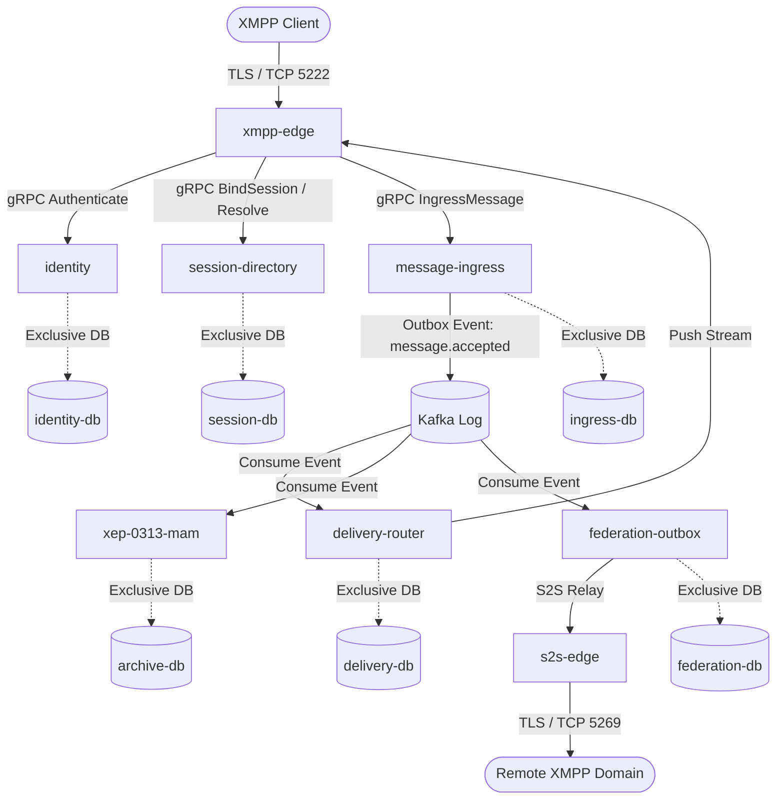

# Northstar Microservices Architecture, Capacity & Production Cutover Specification

**Document Version**: 2.0.0  
**Audit Baseline**: `f32adaafdcd5c20ababfe022e672c571749bb865`  
**Reference Specifications**: `northstar_microservices_deep_audit_2026-09-03.md`, `northstar_progress_and_next_plan_2026-09-04.md`  
**Status**: Architecture prototype; runtime implementation in progress

---

## 1. Architectural Topology Overview

Northstar is actively developing a distributed microservice topology targeting high scalability and database exclusivity. The target architecture strictly enforces:
1. **Stateless Edge Gateways**: `xmpp-edge` handles TCP/TLS/WebSocket socket I/O and framing. It holds zero database connections, zero global business state, and delegates authentication and stanza routing via gRPC.
2. **Exclusive Stateful Databases**: Every stateful microservice owns a dedicated PostgreSQL instance and credentials. Cross-database queries, shared database schemas, foreign keys, and distributed two-phase commit (2PC) are forbidden.
3. **Dual-Channel Eventing**:
   - **Transactional Outbox**: Local database transactions atomically insert business mutations alongside outbox event records (`foundation-eventing`).
   - **Consumer Inbox**: Downstream consumers enforce exactly-once processing semantics over at-least-once Kafka event streams via consumer inbox deduplication.
4. **Resilient Sagas**: Complex workflows (e.g. cross-domain account deletion, avatar migration) are orchestrated by `admin-orchestrator` via forward-recovery and compensation sagas.



---

## 2. Platform Service Catalog & Route Ownership Summary

- **Declared Services**: 49 services declared in `catalog/services.yaml`.
- **Declared Stanza Routes**: 38 unambiguous protocol routes in `catalog/routes.yaml`.
- **Database Tables & Ownership**: 77 distinct tables in `catalog/data-ownership.yaml`, each mapped to exactly one authoritative microservice.
- **Verification**: `scripts/check-microservice-catalog.mjs` verifies 0 orphan services, 0 duplicate routes, and 0 shared database tables across the entire workspace.

---

## 3. High-Throughput (100k Accepted Messages/s) Capacity Model

### 3.1 Design Invariants
- **Target Scale**: 100,000 registered users, 10,000 concurrent online sessions, 100,000 accepted messages per second.
- **Hot-Path Pipeline**:
  $$\text{Edge Frame Parsing} \xrightarrow{< 2\,\text{ms}} \text{Ingress Validation} \xrightarrow{< 5\,\text{ms}} \text{Local DB Outbox Batch} \xrightarrow{< 15\,\text{ms}} \text{Kafka Produce} \xrightarrow{\text{P99} \le 20\,\text{ms}}$$
- **Batching & Partitioning**:
  - Kafka topic `message.accepted.v1` is partitioned by `hash(bare_jid(to))` with 64 partitions to guarantee FIFO per-recipient ordering while allowing linear horizontal scaling.
  - Ingress and Delivery services use bounded lock-free ring buffers (16,384 capacity per worker) with cooperative batch flushes to PostgreSQL (500 items / 5ms max lag).
- **Target SLO Bounds**:
  - Ingress P99: $\le 20\,\text{ms}$
  - Delivery P99: $\le 50\,\text{ms}$
  - Edge Push Stream P99: $\le 10\,\text{ms}$
  - End-to-end accepted-to-delivered latency P99: $\le 80\,\text{ms}$

---

## 4. Multi-Region Routing & Split-Brain Prevention

1. **Home Region Authority**: Each user account is assigned an immutable `home_region`. All state-mutating commands (password change, roster edit, blocking list update) route to the user's home region.
2. **Session Fencing & Epochs**: The `session-directory` service issues monotonically increasing session epochs. Any stale edge gateway attempting to deliver to a superseded session epoch is rejected with an epoch fencing error, eliminating split-brain ABA connection race conditions.
3. **Cross-Region Replication**: Asynchronous replication via Kafka mirror makers ensures read availability across regions while write consistency remains pinned to home-region authorities.

---

## 5. Deployment Topology & Zero-Trust Security

### 5.1 Docker Compose Isolation (`deploy/compose/docker-compose.microservices.yml`)
- Provides 8 independent PostgreSQL containers (`identity-db`, `session-db`, `ingress-db`, `delivery-db`, `muc-db`, `pubsub-db`, `archive-db`, `upload-db`).
- Services connect only via their designated isolated internal networks:
  - `northstar-transport`: External client edge connections.
  - `northstar-internal`: Microservice gRPC and Kafka event mesh.
  - `northstar-data`: Dedicated database communication (no external exposure).

### 5.2 Kubernetes Zero-Trust Network Policies (`deploy/kubernetes/network-policies.yaml`)
- `default-deny-all`: Blocks all unauthorized ingress/egress.
- Strict per-service policies:
  - `xmpp-edge` cannot communicate with databases or private backend services.
  - Stateful services only have egress to their designated database pods and Kafka brokers.

---

## 6. Monolith-to-Microservices Cutover Runbook (Phase R9 & R10)

```mermaid
sequenceDiagram
    autonumber
    participant Op as SRE Operator
    participant Mono as Monolith v1
    participant Mig as data-split-migrator
    participant DBs as Microservice DBs
    participant Micro as Microservices v2
    participant DNS as DNS / Gateway

    Op->>Mono: Activate Read-Only Maintenance Window
    Mono-->>Op: Write queues drained; DB quiescent
    Op->>Mig: Run data-split-migrator (Full Snapshot Split)
    Mig->>DBs: Extract, Transform & Load into 8 Dedicated DBs
    Mig-->>Op: Ownership & Row-Count Verification Passed (100%)
    Op->>Micro: Start Microservices v2 Fleet
    Micro->>DBs: Run Expand/Contract Migrations & Warmup
    Op->>Micro: Execute Synthetic E2E Health Checks
    Micro-->>Op: All gRPC/Kafka Smoke Tests OK
    Op->>DNS: Shift Traffic (Point of No Return)
    DNS->>Micro: Ingress Active Client Connections
    Op->>Mono: Decommission Monolith v1
```

### 6.1 Point of No Return Criteria
1. All 77 tables verified with 0 discrepancies via `data-split-migrator`.
2. Full Kafka broker and database replication sync lag $< 100\,\text{ms}$.
3. Synthetic end-to-end smoke test passes authentication, stanza ingress, delivery push, and MAM query.
4. Once traffic DNS cuts over to `xmpp-edge` v2, all incoming writes commit exclusively to microservices databases.
